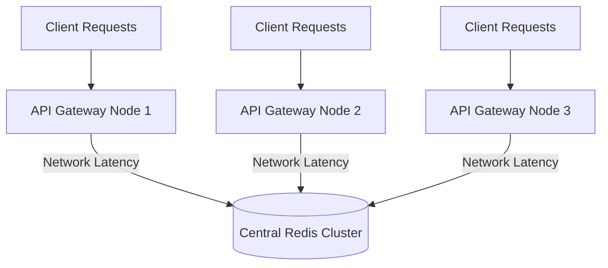

# High-Level Architecture

The Sub-Millisecond Distributed Rate Limiter reimagines rate limiting for FAANG-scale API gateways.

## The Problem: Centralized Bottlenecks

In traditional API Gateway architectures, every gateway node must query a centralized persistence store (like Redis) for every incoming request to decrement and verify rate limit tokens.



**Issues with this design:**
1. **Network Latency:** Every API call incurs an immediate database round-trip penalty (usually 1-5 milliseconds).
2. **Lock Contention:** Millions of requests simultaneously fighting to decrement limits in Redis creates severe CPU overhead and lock contention on the Redis shards.

## The Solution: Decentralized Gossip

This system flips the paradigm. API gateways hold the entire state in local RAM. When a request is served, the gateway instantly checks its local, lock-free memory cache.

After serving the request, the gateway broadcasts a lightweight **Delta** (e.g., "Client X consumed 1 token") to other sibling nodes in the background using the **SWIM Gossip Protocol**.

```mermaid
graph TD
    Client1[Client Requests] --> GW1[API Gateway Node 1]
    Client2[Client Requests] --> GW2[API Gateway Node 2]
    Client3[Client Requests] --> GW3[API Gateway Node 3]

    subgraph Internal Gossip Network (UDP)
        GW1 -.->|SWIM Delta| GW2
        GW1 -.->|SWIM Delta| GW3
        GW2 -.->|SWIM Delta| GW1
        GW3 -.->|SWIM Delta| GW2
    end
```

**Benefits of this design:**
1. **Zero Path Latency:** API requests never wait on external network calls. The limit is enforced against local RAM (~9 nanoseconds overhead).
2. **Eventual Consistency:** Because tokens are rapidly drained from all nodes in the background, limits are still maintained globally across the cluster.
3. **Fault Tolerance:** If a network partition occurs, gateways continue serving traffic based on local, independently refilling tokens, smoothly degrading rather than crashing.

## System Components

- **In-Memory Core Engine (`internal/limiter/`)**: Highly concurrent, lock-free token bucket algorithm.
- **Networking Primitives (`internal/netutil/`)**: Zero-allocation binary packing for minimum UDP footprint and mTLS.
- **Distributed State (`internal/gossip/`)**: HashiCorp's `memberlist` delegating synchronization across the cluster.
- **API Interfaces (`api/v1/`, `cmd/server/`)**: gRPC and raw UDP front-facing endpoints.
