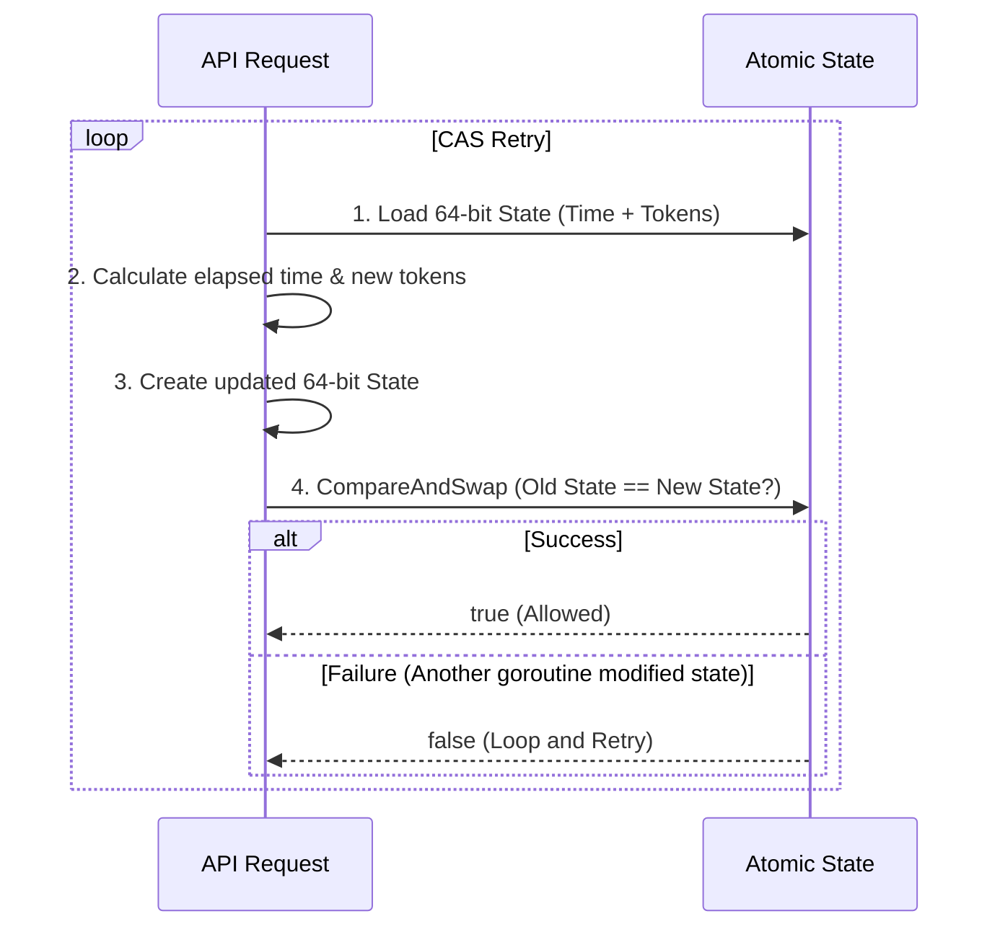

# Low-Level Design (LLD)

Deep dive into the core engine responsible for the `< 0.5ms` p99 latency overhead constraint.

## 1. Lock-Free Atomic Token Bucket

The heart of the rate limiter is the `TokenBucket` algorithm (`internal/limiter/bucket.go`). Rather than using standard Go `sync.Mutex` locks which cause heavy OS-level thread contention under high load, we implement a strictly lock-free bucket using CPU-level atomic instructions.

To achieve this, we compress the entire state of the bucket into a single 64-bit integer (`uint64`):

```text
 64-bit Atomic Variable
┌──────────────────────────────────────────────┬──────────────────────┐
│  Timestamp in Milliseconds (44 bits)         │  Tokens (20 bits)    │
└──────────────────────────────────────────────┴──────────────────────┘
```
- **Time (44 bits)**: Allows tracking milliseconds since Unix epoch, wrapping gracefully after ~550 years.
- **Tokens (20 bits)**: Supports up to 1,048,575 concurrent tokens per client.

### The Compare-and-Swap (CAS) Loop
When an API Gateway requests a token, the bucket executes an optimistic concurrency CAS loop:



By relying on CPU-level hardware atomics, a token is consumed in roughly **9 nanoseconds** without ever putting a goroutine to sleep in a wait queue.

## 2. Sharded Highly-Concurrent Store

Even lock-free buckets require storage. Holding millions of buckets in a standard Go `map[string]*TokenBucket` introduces a massive contention point at the map's `sync.RWMutex`.

We solve this using a Sharded Concurrent Map (`internal/limiter/store.go`), partitioning clients dynamically:

```go
type Store struct {
	shards [256]*shard
}

type shard struct {
	mu      sync.RWMutex
	buckets map[string]*TokenBucket
}
```

- When a client ID (e.g., `user_api_key`) arrives, it is hashed using `FNV-1a` to determine which of the `256` shards it belongs to.
- Lock contention is thus divided by `256` across the system, enabling true `O(1)` parallel access at extreme scale.

## 3. Zero-Allocation UDP Gossip Serialization

The SWIM protocol (provided via HashiCorp `memberlist`) shares clustered state in the background. If Gossip serialization triggers Garbage Collection (GC) pauses, the gateway's latency spikes.

Instead of JSON or `proto`, we use custom binary byte packing (`internal/netutil/serialization.go`):

| Length | Description |
|--------|-------------|
| 1 byte | `MsgType` Enum |
| 4 bytes| `seqID` for deduplication |
| 2 bytes| Number of client Deltas |
| **For each Delta:** | |
| 2 bytes| Client String Length |
| N bytes| Client String ID |
| 8 bytes| `uint64` Consumed count |

This packing mechanism uses `copy()` and `binary.BigEndian` directly onto pre-allocated UDP buffers, resulting in strictly `0 allocs/op`.

## 4. Gossip Deduplication

Because UDP packets over SWIM gossip trees are often re-broadcasted for resilience, the `rateLimiterDelegate` strictly tracks packet `seqID` arrays to ensure idempotent updates. Token drains are mathematically cumulative, meaning the backend ensures `bucket.AllowN()` only processes absolute deltas one time per message origin, averting recursive network draining scenarios.
